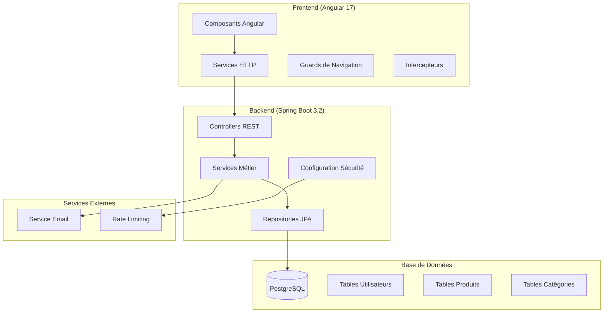
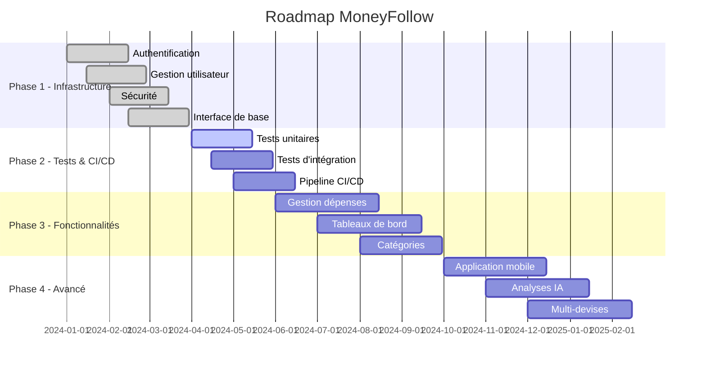

# 💰 MoneyFollow - Application de Suivi de Dépenses Personnelles

[](https://spring.io/projects/spring-boot)
[](https://angular.io/)
[](https://www.postgresql.org/)
[](https://openjdk.java.net/)
[](https://www.typescriptlang.org/)

> **MoneyFollow** est une application web moderne de gestion de dépenses personnelles développée avec Spring Boot et Angular. Elle permet aux utilisateurs de suivre leurs achats, organiser leurs dépenses par catégories et analyser leurs habitudes de consommation.

## 📋 Table des Matières

- [🎯 Vue d'ensemble](#-vue-densemble)
- [🏗️ Architecture](#️-architecture)
- [🛠️ Technologies](#️-technologies)
- [📁 Structure du Projet](#-structure-du-projet)
- [🚀 Installation et Configuration](#-installation-et-configuration)
- [🔧 Configuration](#-configuration)
- [📊 Base de Données](#-base-de-données)
- [🔐 Sécurité](#-sécurité)
- [🌐 API REST](#-api-rest)
- [💻 Frontend](#-frontend)
- [🐳 Docker](#-docker)
- [📱 Fonctionnalités](#-fonctionnalités)
- [🧪 Tests](#-tests)
- [🚀 Déploiement](#-déploiement)
- [🤝 Contribution](#-contribution)
- [📄 Licence](#-licence)

## 🎯 Vue d'ensemble

MoneyFollow est une application full-stack qui offre une solution complète pour la gestion des dépenses personnelles. L'application se compose de :

- **Backend API** : API REST sécurisée développée avec Spring Boot
- **Frontend** : Interface utilisateur moderne développée avec Angular 17
- **Base de données** : PostgreSQL pour la persistance des données
- **Authentification** : Système JWT avec vérification par email
- **Sécurité** : Rate limiting, CORS, validation des données

### 🎨 Design et UX

L'interface utilisateur est conçue avec :
- **Tailwind CSS** pour un design moderne et responsive
- **Angular Material** pour les composants UI
- **Thème sombre/clair** avec des couleurs personnalisées
- **Animations fluides** et transitions
- **Design mobile-first** pour une expérience optimale sur tous les appareils

## 🏗️ Architecture



## 🛠️ Technologies

### Backend
- **Java 17** - Langage de programmation
- **Spring Boot 3.2.0** - Framework principal
- **Spring Security** - Authentification et autorisation
- **Spring Data JPA** - Accès aux données
- **Spring Mail** - Envoi d'emails
- **JWT (jjwt 0.12.3)** - Tokens d'authentification
- **PostgreSQL** - Base de données relationnelle
- **Maven** - Gestion des dépendances
- **Lombok** - Réduction du code boilerplate
- **Bucket4j** - Rate limiting
- **Hibernate** - ORM

### Frontend
- **Angular 17** - Framework frontend
- **TypeScript 5.2** - Langage de programmation
- **Angular Material 17** - Composants UI
- **Tailwind CSS 3.4** - Framework CSS
- **RxJS 7.8** - Programmation réactive
- **Angular Router** - Navigation
- **Angular Forms** - Gestion des formulaires
- **Angular Animations** - Animations

### Outils et Infrastructure
- **Docker & Docker Compose** - Conteneurisation
- **PostgreSQL 15** - Base de données
- **Node.js 18+** - Runtime JavaScript
- **npm** - Gestionnaire de packages
- **Git** - Contrôle de version

## 📁 Structure du Projet

```
MoneyFollow/
├── 📁 backend/                          # API Spring Boot
│   ├── 📁 src/main/java/com/moneyfollow/
│   │   ├── 📁 auth/                     # DTOs d'authentification
│   │   │   ├── AuthenticationRequest.java
│   │   │   ├── AuthenticationResponse.java
│   │   │   └── RegisterRequest.java
│   │   ├── 📁 config/                   # Configuration Spring
│   │   │   ├── ApplicationConfig.java
│   │   │   ├── BucketRateLimiterFilter.java
│   │   │   ├── CorsConfig.java
│   │   │   ├── JwtAuthentificationFilter.java
│   │   │   ├── JwtService.java
│   │   │   └── SecurityConfiguration.java
│   │   ├── 📁 controller/               # Contrôleurs REST
│   │   │   ├── AuthenticationController.java
│   │   │   ├── CategoryController.java
│   │   │   ├── ProductController.java
│   │   │   ├── ResetPasswordController.java
│   │   │   ├── UserController.java
│   │   │   └── VerificationController.java
│   │   ├── 📁 dto/                      # Data Transfer Objects
│   │   │   └── UserDTORecord.java
│   │   ├── 📁 exception/                # Gestion des erreurs
│   │   ├── 📁 model/                    # Entités JPA
│   │   │   ├── Category.java
│   │   │   ├── Product.java
│   │   │   ├── ResetToken.java
│   │   │   ├── Role.java
│   │   │   ├── User.java
│   │   │   └── VerificationToken.java
│   │   ├── 📁 repository/               # Repositories JPA
│   │   │   ├── CategoryRepository.java
│   │   │   ├── ProductRepository.java
│   │   │   ├── ResetTokenRepository.java
│   │   │   ├── UserRepository.java
│   │   │   └── VerificationTokenRepository.java
│   │   ├── 📁 security/                 # Services de sécurité
│   │   │   ├── AuthentificationManager.java
│   │   │   ├── AuthentificationService.java
│   │   │   ├── RateLimited.java
│   │   │   ├── RateLimiterAspect.java
│   │   │   ├── RateLimitExceededException.java
│   │   │   ├── ResetPasswordService.java
│   │   │   └── VerificationService.java
│   │   ├── 📁 service/                  # Services métier
│   │   │   └── MailService.java
│   │   └── MoneyFollowApplication.java  # Classe principale
│   ├── 📁 src/main/resources/
│   │   ├── application.properties       # Configuration dev
│   │   └── application-prod.properties  # Configuration prod
│   └── pom.xml                          # Configuration Maven
├── 📁 frontend/                         # Application Angular
│   ├── 📁 src/app/
│   │   ├── 📁 components/               # Composants Angular
│   │   │   ├── 📁 auth/                 # Composants d'authentification
│   │   │   │   ├── confirm-email/
│   │   │   │   ├── forgot-password/
│   │   │   │   ├── login/
│   │   │   │   ├── register/
│   │   │   │   ├── reset-password/
│   │   │   │   └── verify-email/
│   │   │   ├── 📁 misc/                 # Composants généraux
│   │   │   │   ├── about/
│   │   │   │   ├── footer/
│   │   │   │   ├── home/
│   │   │   │   └── nav-bar/
│   │   │   └── 📁 user/                 # Composants utilisateur
│   │   │       ├── 📁 action/           # Actions utilisateur
│   │   │       │   ├── delete-account/
│   │   │       │   ├── edit-email/
│   │   │       │   ├── edit-name/
│   │   │       │   └── edit-password/
│   │   │       └── profil/
│   │   ├── 📁 guards/                   # Guards de navigation
│   │   │   ├── auth.guard.ts
│   │   │   ├── no-auth.guard.ts
│   │   │   └── no-verified.guard.ts
│   │   ├── 📁 services/                 # Services Angular
│   │   │   ├── auth.service.ts
│   │   │   ├── 📁 request/              # Services de requêtes
│   │   │   │   ├── abstract-request.service.ts
│   │   │   │   ├── security-request.service.ts
│   │   │   │   └── user-request.service.ts
│   │   │   └── 📁 utils/                # Services utilitaires
│   │   │       └── validation.service.ts
│   │   ├── app.component.ts
│   │   ├── app.config.ts
│   │   └── app.routes.ts
│   ├── 📁 src/assets/                   # Assets statiques
│   ├── 📁 src/environments/             # Variables d'environnement
│   ├── 📁 src/styles/                   # Styles SCSS
│   ├── package.json
│   ├── tailwind.config.js
│   └── angular.json
├── 📁 database/                         # Scripts SQL
│   └── init.sql
├── docker-compose.yml                   # Configuration Docker
├── install.sh                          # Script d'installation
├── commande.md                         # Commandes utiles
└── README.md                           # Documentation principale
```

## 🚀 Installation et Configuration

### Prérequis

Assurez-vous d'avoir installé les outils suivants :

- **Java 17+** - [Télécharger OpenJDK](https://openjdk.java.net/)
- **Node.js 18+** - [Télécharger Node.js](https://nodejs.org/)
- **Maven 3.8+** - [Télécharger Maven](https://maven.apache.org/)
- **PostgreSQL 13+** - [Télécharger PostgreSQL](https://www.postgresql.org/)
- **Docker & Docker Compose** - [Télécharger Docker](https://www.docker.com/)

### Vérification des prérequis

```bash
# Vérifier Java
java -version

# Vérifier Maven
mvn -version

# Vérifier Node.js
node -version

# Vérifier npm
npm -version

# Vérifier Docker
docker --version
docker-compose --version
```

### Installation rapide

1. **Cloner le repository**
```bash
git clone https://github.com/votre-username/MoneyFollow.git
cd MoneyFollow
```

2. **Utiliser le script d'installation**
```bash
chmod +x install.sh
./install.sh
```

### Installation manuelle

#### 1. Configuration de la base de données

```bash
# Démarrer PostgreSQL avec Docker
docker-compose up -d postgres

# Ou installer PostgreSQL localement et créer la base
createdb moneyfollow
```

#### 2. Configuration du backend

```bash
cd backend

# Installer les dépendances Maven
mvn clean install

# Configurer les variables d'environnement
cp src/main/resources/application.properties src/main/resources/application-local.properties
# Éditer application-local.properties avec vos paramètres
```

#### 3. Configuration du frontend

```bash
cd frontend

# Installer les dépendances npm
npm install

# Installer Angular CLI globalement (si nécessaire)
npm install -g @angular/cli
```

## 🔧 Configuration

### Variables d'environnement

#### Backend (`application.properties`)

```properties
# Configuration de l'application
spring.application.name=MoneyFollow
server.port=8000

# Configuration de la base de données
spring.datasource.url=jdbc:postgresql://localhost:5432/moneyfollow
spring.datasource.username=moneyfollow_user
spring.datasource.password=votre_mot_de_passe
spring.datasource.driver-class-name=org.postgresql.Driver

# Configuration JPA/Hibernate
spring.jpa.hibernate.ddl-auto=update
spring.jpa.show-sql=true
spring.jpa.properties.hibernate.format_sql=true
spring.jpa.properties.hibernate.dialect=org.hibernate.dialect.PostgreSQLDialect

# Configuration JWT
jwt.secret=votre_cle_secrete_jwt
jwt.expiration=86400000

# Configuration email
spring.mail.host=votre_smtp_host
spring.mail.port=587
spring.mail.username=votre_email
spring.mail.password=votre_mot_de_passe_email
spring.mail.properties.mail.smtp.auth=true
spring.mail.properties.mail.smtp.starttls.enable=true

# Configuration CORS
cors.allowed-origin=http://localhost:4200
app.frontend.url=http://localhost:4200

# Configuration des logs
logging.level.com.moneyfollow=DEBUG
logging.level.org.springframework.security=DEBUG
```

#### Frontend (`environment.ts`)

```typescript
export const environment = {
  production: false,
  apiUrl: 'http://localhost:8000'
};
```

### Configuration de production

Pour la production, utilisez `application-prod.properties` et `environment.prod.ts` avec les paramètres appropriés.

## 📊 Base de Données

### Schéma de la base de données

```sql
-- Table des utilisateurs
CREATE TABLE _user (
    id_user BIGSERIAL PRIMARY KEY,
    name VARCHAR(255) NOT NULL,
    email VARCHAR(254) NOT NULL UNIQUE,
    password VARCHAR(255) NOT NULL,
    is_verified BOOLEAN DEFAULT FALSE,
    created_at TIMESTAMP DEFAULT CURRENT_TIMESTAMP,
    role VARCHAR(20) DEFAULT 'USER'
);

-- Table des catégories
CREATE TABLE categorie (
    id_category BIGSERIAL PRIMARY KEY,
    name VARCHAR(100) NOT NULL,
    description TEXT,
    id_user BIGINT NOT NULL REFERENCES _user(id_user)
);

-- Table des produits
CREATE TABLE product (
    id_product BIGSERIAL PRIMARY KEY,
    name VARCHAR(255) NOT NULL,
    qtt INTEGER DEFAULT 1,
    description TEXT,
    created_at TIMESTAMP DEFAULT CURRENT_TIMESTAMP,
    image_path VARCHAR(255) DEFAULT 'default_product.png',
    currency VARCHAR(20) DEFAULT 'EUR',
    price DECIMAL(15,2) NOT NULL,
    id_user BIGINT NOT NULL REFERENCES _user(id_user)
);

-- Table de liaison produits-catégories
CREATE TABLE trier (
    id_product BIGINT REFERENCES product(id_product),
    id_category BIGINT REFERENCES categorie(id_category),
    PRIMARY KEY (id_product, id_category)
);

-- Table des tokens de vérification
CREATE TABLE verification_token (
    id BIGSERIAL PRIMARY KEY,
    token VARCHAR(255) NOT NULL UNIQUE,
    user_id BIGINT NOT NULL REFERENCES _user(id_user),
    expiry_date TIMESTAMP NOT NULL
);

-- Table des tokens de réinitialisation
CREATE TABLE reset_token (
    id BIGSERIAL PRIMARY KEY,
    token VARCHAR(255) NOT NULL UNIQUE,
    user_id BIGINT NOT NULL REFERENCES _user(id_user),
    expiry_date TIMESTAMP NOT NULL
);
```

### Initialisation

La base de données sera créée automatiquement par Hibernate lors du premier démarrage de l'application avec la configuration `spring.jpa.hibernate.ddl-auto=update`.

## 🔐 Sécurité

### Authentification JWT

L'application utilise un système d'authentification basé sur JWT (JSON Web Tokens) :

- **Génération** : Tokens générés lors de la connexion/inscription
- **Validation** : Vérification automatique des tokens sur chaque requête
- **Expiration** : Tokens valides pendant 24 heures
- **Refresh** : Renouvellement automatique côté client

### Rate Limiting

Protection contre les attaques par déni de service :

- **Inscription** : 5 tentatives par 5 minutes
- **Connexion** : 6 tentatives par 5 minutes
- **API utilisateur** : 50 requêtes par minute
- **Suppression de compte** : 1 tentative par minute

### Validation des données

- **Backend** : Validation avec Bean Validation (JSR-303)
- **Frontend** : Validation côté client avec Angular Forms
- **Sanitisation** : Protection contre les injections XSS

### CORS

Configuration CORS pour permettre les requêtes cross-origin :

```java
@Configuration
public class CorsConfig {
    @Bean
    public CorsConfigurationSource corsConfigurationSource() {
        CorsConfiguration configuration = new CorsConfiguration();
        configuration.setAllowedOrigins(Arrays.asList("http://localhost:4200"));
        configuration.setAllowedMethods(Arrays.asList("GET", "POST", "PUT", "DELETE", "OPTIONS"));
        configuration.setAllowedHeaders(Arrays.asList("*"));
        configuration.setAllowCredentials(true);
        return new UrlBasedCorsConfigurationSource();
    }
}
```

## 🌐 API REST

### Endpoints d'authentification

| Méthode | Endpoint | Description | Authentification |
|---------|----------|-------------|------------------|
| `POST` | `/auth/register` | Inscription d'un nouvel utilisateur | ❌ |
| `POST` | `/auth/authenticate` | Connexion utilisateur | ❌ |

### Endpoints utilisateur

| Méthode | Endpoint | Description | Authentification |
|---------|----------|-------------|------------------|
| `GET` | `/api/user` | Récupérer les informations utilisateur | ✅ |
| `PATCH` | `/api/user` | Modifier les informations utilisateur | ✅ |
| `GET` | `/api/user/isVerified` | Vérifier le statut de vérification | ✅ |
| `GET` | `/api/user/search/email` | Vérifier la disponibilité d'un email | ✅ |
| `DELETE` | `/api/user` | Supprimer le compte utilisateur | ✅ |

### Endpoints produits

| Méthode | Endpoint | Description | Authentification |
|---------|----------|-------------|------------------|
| `POST` | `/api/products` | Créer un nouveau produit | ✅ |
| `GET` | `/api/products` | Récupérer tous les produits | ✅ |
| `GET` | `/api/products/{id}` | Récupérer un produit par ID | ✅ |
| `GET` | `/api/products/search?name=...` | Rechercher des produits | ✅ |
| `PUT` | `/api/products/{id}` | Modifier un produit | ✅ |
| `DELETE` | `/api/products/{id}` | Supprimer un produit | ✅ |

### Endpoints catégories

| Méthode | Endpoint | Description | Authentification |
|---------|----------|-------------|------------------|
| `POST` | `/api/categories` | Créer une nouvelle catégorie | ✅ |

### Exemples de requêtes

#### Inscription
```bash
curl -X POST http://localhost:8000/auth/register \
  -H "Content-Type: application/json" \
  -d '{
    "username": "John Doe",
    "email": "john@example.com",
    "password": "motdepasse123"
  }'
```

#### Connexion
```bash
curl -X POST http://localhost:8000/auth/authenticate \
  -H "Content-Type: application/json" \
  -d '{
    "email": "john@example.com",
    "password": "motdepasse123"
  }'
```

#### Créer un produit
```bash
curl -X POST http://localhost:8000/api/products \
  -H "Content-Type: application/json" \
  -H "Authorization: Bearer YOUR_JWT_TOKEN" \
  -d '{
    "name": "Laptop",
    "description": "Ordinateur portable",
    "price": 999.99,
    "currency": "EUR",
    "qtt": 1
  }'
```

## 💻 Frontend

### Architecture Angular

L'application frontend utilise Angular 17 avec une architecture moderne :

- **Standalone Components** : Composants autonomes sans modules
- **Reactive Forms** : Gestion des formulaires avec validation
- **Guards** : Protection des routes
- **Services** : Logique métier et communication avec l'API
- **Interceptors** : Gestion des requêtes HTTP

### Structure des composants

#### Composants d'authentification
- **LoginComponent** : Connexion utilisateur
- **RegisterComponent** : Inscription utilisateur
- **ForgotPasswordComponent** : Demande de réinitialisation
- **ResetPasswordComponent** : Réinitialisation du mot de passe
- **VerifyEmailComponent** : Vérification d'email
- **ConfirmEmailComponent** : Confirmation d'envoi d'email

#### Composants utilisateur
- **ProfilComponent** : Gestion du profil
- **EditNameComponent** : Modification du nom
- **EditEmailComponent** : Modification de l'email
- **EditPasswordComponent** : Modification du mot de passe
- **DeleteAccountComponent** : Suppression du compte

#### Composants généraux
- **HomeComponent** : Page d'accueil
- **AboutComponent** : Page à propos
- **NavBarComponent** : Barre de navigation
- **FooterComponent** : Pied de page

### Services

#### AuthService
```typescript
@Injectable({
  providedIn: 'root'
})
export class AuthService {
  login(email: string, password: string): Observable<any>
  register(email: string, password: string, username: string): Observable<any>
  logout(): void
  isLoggedIn(): boolean
  isTokenExpired(): boolean
  getToken(): string | null
}
```

#### UserRequestService
```typescript
@Injectable({
  providedIn: 'root'
})
export class UserRequestService extends AbstractRequestService {
  getUser(): Observable<User>
  isVerified(): Observable<boolean>
  patchUserPassword(password: string): Observable<User>
  patchUserEmail(email: string): Observable<User>
  patchUserName(name: string): Observable<User>
  deleteUser(): Observable<void>
}
```

### Guards de navigation

#### AuthGuard
```typescript
export const authGuard: CanActivateFn = (route, state) => {
  const authService = inject(AuthService);
  const router = inject(Router);
  
  if (!authService.isLoggedIn()) {
    router.navigate(['/login']);
    return false;
  }
  return true;
};
```

#### NoAuthGuard
```typescript
export const noAuthGuard: CanActivateFn = (route, state) => {
  const authService = inject(AuthService);
  const router = inject(Router);
  
  if (authService.isLoggedIn()) {
    router.navigate(['/profil']);
    return false;
  }
  return true;
};
```

### Styling avec Tailwind CSS

L'application utilise Tailwind CSS avec un thème personnalisé :

```javascript
// tailwind.config.js
module.exports = {
  theme: {
    extend: {
      colors: {
        primary: {
          500: '#5B7CFF', // bleu-violet clair
          600: '#4B5FE8',
          700: '#3D4BC2',
        },
        secondary: {
          500: '#8A46E8', // violet principal
          600: '#7538C4',
          700: '#602DA1',
        },
        accent: {
          200: '#00C2FF',
          300: '#009ACF',
        }
      }
    }
  }
}
```

## 🐳 Docker

### Configuration Docker Compose

```yaml
version: '3.8'

services:
  postgres:
    image: postgres:15
    container_name: moneyfollow-postgres
    environment:
      POSTGRES_DB: moneyfollow
      POSTGRES_USER: postgres
      POSTGRES_PASSWORD: postgres
    ports:
      - "5432:5432"
    volumes:
      - postgres_data:/var/lib/postgresql/data
    networks:
      - moneyfollow-network

  backend:
    build: ./backend
    container_name: moneyfollow-backend
    ports:
      - "8080:8080"
    depends_on:
      - postgres
    environment:
      SPRING_DATASOURCE_URL: jdbc:postgresql://postgres:5432/moneyfollow
      SPRING_DATASOURCE_USERNAME: postgres
      SPRING_DATASOURCE_PASSWORD: postgres
    networks:
      - moneyfollow-network

volumes:
  postgres_data:

networks:
  moneyfollow-network:
    driver: bridge
```

### Commandes Docker

```bash
# Démarrer tous les services
docker-compose up -d

# Démarrer uniquement PostgreSQL
docker-compose up -d postgres

# Voir les logs
docker-compose logs -f

# Redémarrer un service
docker-compose restart backend

# Arrêter tous les services
docker-compose down

# Supprimer les volumes
docker-compose down -v
```

## 🗺️ Roadmap du Projet

### ✅ Phase 1 : Infrastructure et Authentification (TERMINÉE)

- **🔐 Système d'authentification complet**
  - ✅ Inscription avec validation email
  - ✅ Connexion sécurisée avec JWT
  - ✅ Vérification d'email obligatoire
  - ✅ Réinitialisation de mot de passe
  - ✅ Gestion des sessions et tokens

- **👤 Gestion du profil utilisateur**
  - ✅ Modification du nom, email, mot de passe
  - ✅ Vérification de disponibilité des emails
  - ✅ Suppression de compte
  - ✅ Interface de profil intuitive

- **🛡️ Sécurité et infrastructure**
  - ✅ Rate limiting sur toutes les routes
  - ✅ Protection CORS
  - ✅ Validation des données
  - ✅ Tokens JWT sécurisés
  - ✅ Hachage des mots de passe
  - ✅ Configuration Docker
  - ✅ Base de données PostgreSQL

- **🎨 Interface utilisateur de base**
  - ✅ Design responsive avec Tailwind CSS
  - ✅ Thème sombre/clair
  - ✅ Animations fluides
  - ✅ Composants Angular Material
  - ✅ Navigation intuitive
  - ✅ Guards de navigation

### 🚧 Phase 2 : Tests et CI/CD (EN COURS)

- **🧪 Tests automatisés**
  - 🔄 Tests unitaires backend (Spring Boot)
  - 🔄 Tests unitaires frontend (Angular)
  - 🔄 Tests d'intégration API
  - 🔄 Tests end-to-end (E2E)
  - 🔄 Couverture de code

- **🔄 CI/CD Pipeline**
  - 🔄 GitHub Actions
  - 🔄 Tests automatiques sur PR
  - 🔄 Build et déploiement automatique
  - 🔄 Qualité du code (SonarQube)
  - 🔄 Sécurité (dépendances, secrets)

### 📋 Phase 3 : Fonctionnalités principales (PLANIFIÉE)

- **💰 Gestion des dépenses**
  - 📝 Ajout de produits/dépenses
  - 📝 Organisation par catégories
  - 📝 Historique des transactions
  - 📝 Recherche et filtres avancés
  - 📝 Import/Export de données

- **📊 Tableaux de bord et analyses**
  - 📝 Graphiques de dépenses (Chart.js/D3.js)
  - 📝 Statistiques mensuelles/annuelles
  - 📝 Comparaisons de périodes
  - 📝 Alertes de budget
  - 📝 Objectifs d'épargne

- **🏷️ Gestion des catégories**
  - 📝 Création et modification de catégories
  - 📝 Catégories prédéfinies
  - 📝 Icônes et couleurs personnalisées
  - 📝 Hiérarchie de catégories

### 🔮 Phase 4 : Fonctionnalités avancées (FUTURE)

- **📱 Application mobile**
  - 📝 PWA (Progressive Web App)
  - 📝 Notifications push
  - 📝 Mode hors ligne
  - 📝 Synchronisation automatique

- **📈 Analyses avancées**
  - 📝 Prédictions de dépenses (IA/ML)
  - 📝 Recommandations d'épargne
  - 📝 Analyse des tendances
  - 📝 Rapports personnalisés

- **🌍 Multi-devises et internationalisation**
  - 📝 Support de plusieurs devises
  - 📝 Conversion automatique
  - 📝 Historique des taux
  - 📝 Géolocalisation
  - 📝 Multi-langues (i18n)

- **👥 Fonctionnalités sociales**
  - 📝 Partage de budgets
  - 📝 Comparaisons anonymes
  - 📝 Conseils communautaires
  - 📝 Défis d'épargne

### 🎯 Phase 5 : Optimisation et production (FUTURE)

- **⚡ Performance**
  - 📝 Optimisation des requêtes
  - 📝 Cache Redis
  - 📝 CDN pour les assets
  - 📝 Lazy loading

- **🔒 Sécurité avancée**
  - 📝 Audit de sécurité
  - 📝 Chiffrement des données sensibles
  - 📝 2FA (Authentification à deux facteurs)
  - 📝 Conformité RGPD

- **☁️ Infrastructure cloud**
  - 📝 Déploiement sur AWS/Azure
  - 📝 Monitoring et alertes
  - 📝 Sauvegarde automatique
  - 📝 Scaling automatique

## 📊 État d'avancement



### 📈 Métriques de progression

- **Phase 1** : ✅ **100%** - Infrastructure et authentification terminées
- **Phase 2** : 🔄 **25%** - Tests et CI/CD en cours
- **Phase 3** : 📋 **0%** - Fonctionnalités principales planifiées
- **Phase 4** : 🔮 **0%** - Fonctionnalités avancées futures
- **Phase 5** : 🎯 **0%** - Optimisation et production futures

### 🎯 Prochaines étapes prioritaires

1. **Compléter les tests** (Phase 2)
   - Tests unitaires backend et frontend
   - Tests d'intégration API
   - Configuration du pipeline CI/CD

2. **Développer les fonctionnalités core** (Phase 3)
   - CRUD complet pour les produits/dépenses
   - Système de catégories
   - Interface de gestion des dépenses

3. **Créer les tableaux de bord** (Phase 3)
   - Graphiques de visualisation
   - Statistiques et analyses
   - Interface de reporting

## 🧪 Tests

### Backend (Spring Boot)

```bash
# Exécuter tous les tests
mvn test

# Exécuter les tests avec couverture
mvn test jacoco:report

# Tests d'intégration
mvn verify
```

### Frontend (Angular)

```bash
# Tests unitaires
ng test

# Tests e2e
ng e2e

# Tests avec couverture
ng test --code-coverage
```

### Tests d'API

```bash
# Tests avec Postman/Newman
newman run tests/MoneyFollow.postman_collection.json

# Tests avec curl
./scripts/test-api.sh
```

## 🚀 Déploiement

### Déploiement en développement

```bash
# 1. Démarrer PostgreSQL
docker-compose up -d postgres

# 2. Démarrer le backend
cd backend
mvn spring-boot:run

# 3. Démarrer le frontend
cd frontend
ng serve
```

### Déploiement en production

#### Backend

```bash
# Build du JAR
mvn clean package -Pprod

# Déploiement avec Docker
docker build -t moneyfollow-backend ./backend
docker run -p 8080:8080 moneyfollow-backend
```

#### Frontend

```bash
# Build de production
ng build --configuration production

# Déploiement sur serveur web
rsync -av dist/moneyfollow-frontend/ user@server:/var/www/html/
```

### Variables d'environnement de production

```bash
# Backend
export SPRING_PROFILES_ACTIVE=prod
export SPRING_DATASOURCE_URL=jdbc:postgresql://prod-db:5432/moneyfollow
export JWT_SECRET=your-production-secret
export MAIL_HOST=your-smtp-host

# Frontend
export API_URL=https://api.moneyfollow.com
```

## 🤝 Contribution

### Comment contribuer

1. **Fork le projet**
```bash
git clone https://github.com/votre-username/MoneyFollow.git
cd MoneyFollow
```

2. **Créer une branche feature**
```bash
git checkout -b feature/nouvelle-fonctionnalite
```

3. **Développer et tester**
```bash
# Backend
mvn test

# Frontend
ng test
```

4. **Commit et push**
```bash
git add .
git commit -m "feat: ajout nouvelle fonctionnalité"
git push origin feature/nouvelle-fonctionnalite
```

5. **Ouvrir une Pull Request**

### Standards de code

#### Backend (Java)
- Suivre les conventions Java
- Utiliser Lombok pour réduire le boilerplate
- Documenter les méthodes publiques
- Tests unitaires pour chaque service

#### Frontend (TypeScript)
- Suivre le style guide Angular
- Utiliser TypeScript strict
- Composants standalone
- Tests unitaires pour chaque composant

### Workflow Git

```bash
# Branches principales
main          # Branche de production
develop       # Branche de développement
feature/*     # Nouvelles fonctionnalités
bugfix/*      # Corrections de bugs
hotfix/*      # Corrections urgentes
```

## 📄 Licence

Ce projet est sous licence MIT.

```
MIT License

Copyright (c) 2024 MoneyFollow

Permission is hereby granted, free of charge, to any person obtaining a copy
of this software and associated documentation files (the "Software"), to deal
in the Software without restriction, including without limitation the rights
to use, copy, modify, merge, publish, distribute, sublicense, and/or sell
copies of the Software, and to permit persons to whom the Software is
furnished to do so, subject to the following conditions:

The above copyright notice and this permission notice shall be included in all
copies or substantial portions of the Software.

THE SOFTWARE IS PROVIDED "AS IS", WITHOUT WARRANTY OF ANY KIND, EXPRESS OR
IMPLIED, INCLUDING BUT NOT LIMITED TO THE WARRANTIES OF MERCHANTABILITY,
FITNESS FOR A PARTICULAR PURPOSE AND NONINFRINGEMENT. IN NO EVENT SHALL THE
AUTHORS OR COPYRIGHT HOLDERS BE LIABLE FOR ANY CLAIM, DAMAGES OR OTHER
LIABILITY, WHETHER IN AN ACTION OF CONTRACT, TORT OR OTHERWISE, ARISING FROM,
OUT OF OR IN CONNECTION WITH THE SOFTWARE OR THE USE OR OTHER DEALINGS IN THE
SOFTWARE.
```

## 📞 Support

Pour toute question ou problème :

- **Issues GitHub** : [Créer une issue](https://github.com/LINDECKER-Charles/MoneyFollow/issues)
- **Email** : charles.lindecker@outlook.fr

---

<div align="center">

**💰 MoneyFollow - Suivez vos dépenses, maîtrisez votre budget**

[](https://github.com/LINDECKER-Charles/MoneyFollow)
[](https://github.com/LINDECKER-Charles/MoneyFollow)
[](https://github.com/LINDECKER-Charles/MoneyFollow/issues)

</div>